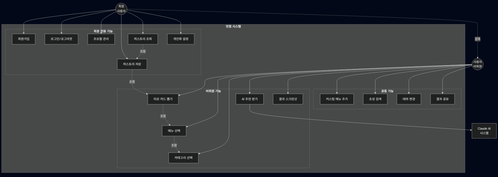
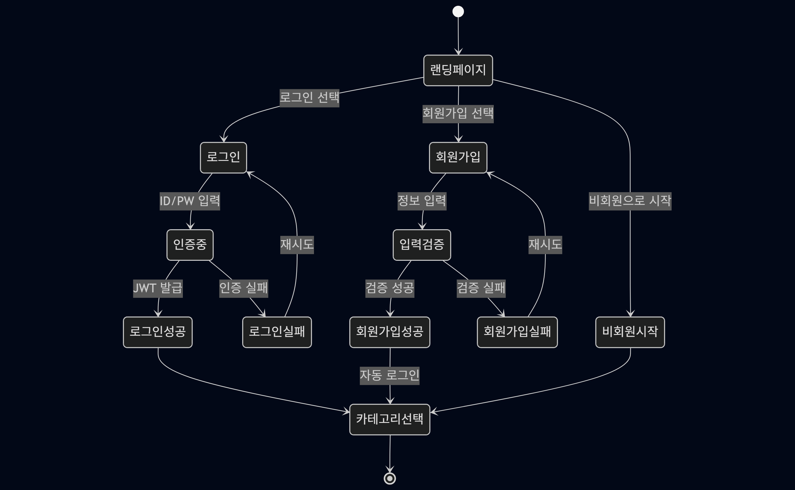
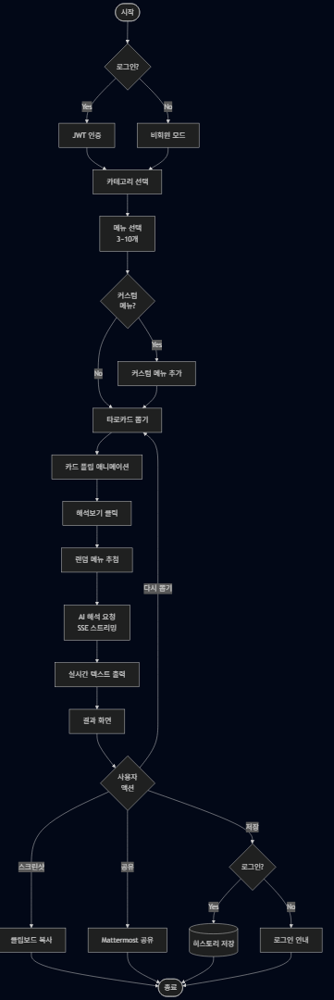
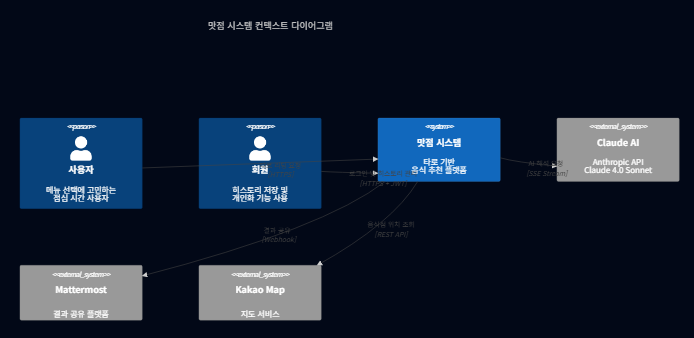
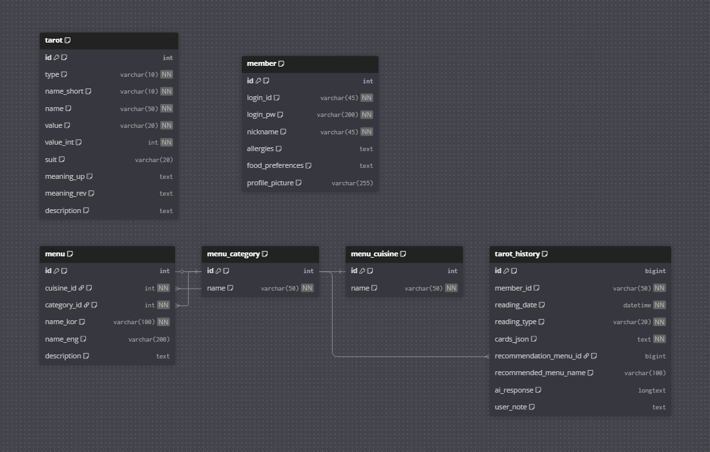
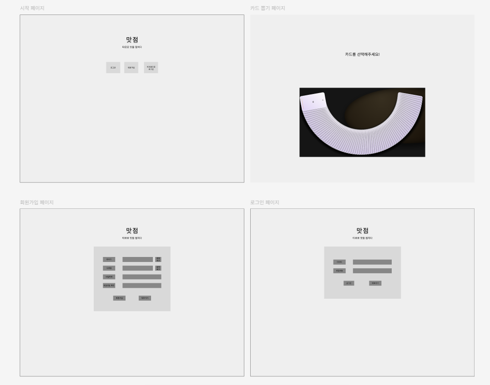
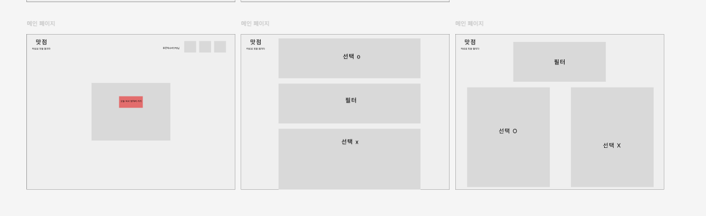

# 맛점 (MATJEOM) - 타로 기반 음식 추천 서비스

> "맛을 점치다" - 타로카드와 AI를 활용한 개인화 메뉴 추천 플랫폼

---


---

## 프로젝트 개요

**맛점**은 타로카드 리딩과 Claude 4.0 Sonnet AI를 결합하여 사용자에게 개인화된 음식 추천을 제공하는 웹 애플리케이션입니다. 사용자는 음식 카테고리와 메뉴를 선택한 후 타로카드를 뽑으면, AI가 타로카드의 의미를 해석하여 운명적인 메뉴를 추천합니다.

### 핵심 가치

- **재미있는 의사결정**: 점심 메뉴 고민을 타로 리딩으로 해결
- **깊이 있는 개인화**: 알러지 정보, 식습관, 종교적 식문화(할랄 등)까지 고려한 안전하고 맞춤화된 추천
- **몰입형 사용자 경험**: 실제 타로점을 방문한 듯한 카드 셔플 애니메이션, 커튼 오프닝, 3D 플립 효과로 카드를 뽑는 순간의 도파민 극대화
- **실시간 AI 스트리밍**: SSE 방식으로 타로 해석이 한 글자씩 생성되는 과정을 실시간으로 표시

### 주요 특징

- **완벽한 타로카드 구현**: 78장의 타로카드 (메이저/마이너 아르카나, 정방향/역방향) 완전 지원
- **건강과 안전 최우선**: 사용자의 알러지 정보를 AI 프롬프트에 반영하여 위험 성분이 포함된 메뉴 추천 시 경고 제공
- **다양한 식문화 존중**: 개인의 식습관, 종교적 제약(할랄, 코셔 등), 선호도를 고려한 추천
- **직관적인 한글 검색**: 초성 검색 (예: "ㄹㅁ" → "라면") 및 커스텀 메뉴 추가 기능
- **실감나는 애니메이션**:
  - 카드 셔플 시 흩뿌려지고 모이는 애니메이션
  - 미스티컬 커튼 오프닝 연출
  - 3D 카드 플립과 오라 이펙트
  - SVG 마법진 패턴과 회전하는 심볼
- **타로 히스토리 관리**: 과거 타로 기록 저장 및 스크린샷 공유
- **세련된 테마 시스템**: Glass morphism 디자인과 다크/라이트 테마 지원
- **Claude 4.0 Sonnet**: 최신 AI 모델 기반 실시간 스트리밍 해석

---

## 기술 스택

### Frontend

- **HTML/CSS/Javascript** - 반응형 디자인 및 인터랙션 구현
- **Vue.js 3.5.25** - Composition API 기반 SPA
- **Vite 6.0.11** - 빠른 번들링 및 HMR
- **Pinia 2.2.8** - 상태 관리
- **Vue Router 4.5.0** - 클라이언트 사이드 라우팅
- **Axios 1.7.9** - HTTP 통신
- **html2canvas 1.4.1** - 결과 화면 스크린샷

### Backend

- **Spring Boot 3.5.8** - Java 17 기반 RESTful API
- **Spring Security** - JWT 기반 인증/인가
- **JJWT 0.12.3** - JWT 토큰 생성 및 검증
- **Jackson** - JSON 데이터 처리
- **MySQL Connector** - 데이터베이스 연결

### AI Server

- **Python 3.8+** - FastAPI 프레임워크
- **FastAPI** - 비동기 웹 프레임워크
- **Claude 4.0 Sonnet** - Anthropic API
- **Uvicorn** - ASGI 서버
- **SSE (Server-Sent Events)** - 실시간 스트리밍

### Database

- **MySQL 8.0** - 관계형 데이터베이스

### 배포 및 환경

- **Git** - 버전 관리
- **npm/pnpm** - 패키지 관리
- **Maven** - 빌드 도구
- **Claude Code** - AI Agent

---

## 유스케이스 다이어그램

### 전체 시스템 유스케이스



### 주요 유스케이스 상세

#### 1️⃣ 타로 메뉴 추천 프로세스


#### 2️⃣ 회원 인증 프로세스



#### 3️⃣ 데이터 흐름도



#### 4️⃣ 시스템 컨텍스트 다이어그램



## 클래스 다이어그램



## ER 다이어그램



## 화면설계서





---

## 주요 페이지 및 기능

### 1. 랜딩 페이지 (`/`)

**컴포넌트:** [LandingPage.vue](front/src/views/LandingPage.vue)

#### 화면 구성

- **로고 및 타이틀**: 🔮 맛점 - "맛을 점치다"
- **서브타이틀**: "오늘 점심 메뉴 고민은 그만! 타로 카드가 당신의 메뉴를 책임집니다"
- **3가지 진입 옵션**:
  - 🔑 **로그인** → 기존 회원 로그인
  - ✨ **회원가입** → 신규 회원 등록
  - 🎯 **비회원으로 시작** → 로그인 없이 카테고리 선택 페이지로 이동

#### 주요 기능 소개 카드

- 🎴 **타로 카드로 메뉴 추천** - 78장 타로카드 기반 추천
- 👥 **그룹 타로 세션** - 여러 사람과 함께하는 타로 리딩
- 📊 **맛집 히스토리** - 과거 타로 기록 저장 및 조회

#### UI/UX 특징

- Glass morphism 디자인
- 반짝이는 별 배경 애니메이션
- 부드러운 버튼 호버 효과
- 미스티컬 테마 (✦, ✧ 장식 요소)

---

### 2. 로그인 페이지 (`/login`)

**컴포넌트:** [LoginPage.vue](front/src/views/LoginPage.vue)

#### 입력 필드

- **아이디** (userId) - 필수 입력
- **비밀번호** (password) - 필수 입력
- **자동 로그인 체크박스**
  - ✓ 체크 시: `localStorage` 저장 (브라우저 닫아도 유지)
  - ✗ 미체크 시: `sessionStorage` 저장 (브라우저 닫으면 로그아웃)

#### 로그인 프로세스

```javascript
// 1. 사용자 입력 검증
if (userId.trim() && password.trim()) {
  // 2. API 요청 (POST /api/auth/login)
  const result = await authStore.loginWithApi(userId, password, autoLogin);

  // 3. JWT 토큰 발급 및 저장
  if (result.success) {
    // autoLogin에 따라 localStorage 또는 sessionStorage에 저장
    router.push("/category"); // 카테고리 선택 페이지로 이동
  }
}
```

#### 부가 기능

- **회원가입 링크** - 회원가입 페이지로 이동
- **비회원으로 시작하기** - 메뉴 선택 페이지로 바로 이동
- **뒤로가기 버튼** (←) - 랜딩 페이지로 복귀

#### API 연동

- **Endpoint**: `POST /api/auth/login`
- **Request Body**: `{ userId, password }`
- **Response**: `{ success, data: { user, token }, message }`
- **인증 방식**: JWT (24시간 유효)

---

### 3. 회원가입 페이지 (`/register`)

**컴포넌트:** [RegisterPage.vue](front/src/views/RegisterPage.vue)

#### 입력 필드 및 검증

1. **아이디** (userId)

   - 필수 입력
   - 최소 4자 이상
   - 실시간 유효성 검사 (`@blur` 이벤트)

2. **닉네임** (nickname)

   - 필수 입력
   - 최소 2자 이상

3. **비밀번호** (password)

   - 필수 입력
   - 최소 8자 이상
   - 입력 시 비밀번호 확인 필드도 재검증

4. **비밀번호 확인** (passwordConfirm)
   - 필수 입력
   - 비밀번호와 일치 여부 검증

#### 유효성 검증 로직

```javascript
// 실시간 검증 (각 필드 blur 시)
const validateUserId = () => {
  if (userId.trim() === "") {
    errors.userId = "아이디를 입력해주세요";
  } else if (userId.length < 4) {
    errors.userId = "아이디는 4자 이상이어야 합니다";
  } else {
    errors.userId = "";
  }
};

// 폼 전체 검증 (computed)
const isFormValid = computed(() => {
  return (
    userId.trim() !== "" &&
    nickname.trim() !== "" &&
    password.trim() !== "" &&
    password === passwordConfirm &&
    userId.length >= 4 &&
    nickname.length >= 2 &&
    password.length >= 8 &&
    !errors.userId &&
    !errors.nickname &&
    !errors.password &&
    !errors.passwordConfirm
  );
});
```

#### 회원가입 프로세스

```javascript
// 1. 모든 필드 검증
validateAllFields();

// 2. API 요청 (POST /api/auth/signup)
const result = await authStore.signupWithApi(userId, password, nickname);

// 3. 자동 로그인 처리
if (result.success) {
  alert(`환영합니다, ${nickname}님! 🎉`);
  router.push("/category"); // 카테고리 선택으로 자동 이동
}
```

#### API 연동

- **Endpoint**: `POST /api/auth/signup`
- **Request Body**: `{ userId, password, nickname }`
- **Response**: `{ success, data: { user, token }, message }`
- **특징**: 회원가입 성공 시 자동 로그인 처리

---

### 4. 카테고리 선택 페이지 (`/category`)

**컴포넌트:** [CategorySelector.vue](front/src/views/CategorySelector.vue)

#### 선택 가능한 카테고리 (14개)

```javascript
// 활성화된 카테고리
🍚 한식 - "따뜻한 한 끼"
🍝 양식 - "이국적인 맛"
🍱 일식 - "깔끔한 정갈함"
🥟 중식 - "풍부한 맛"
☕ 카페/디저트 - "달콤한 여유"
🍔 패스트푸드 - "빠르고 간편하게"
🍜 분식 - "간편한 한 끼"
🍜 태국/베트남 - "동남아의 풍미"
🍛 인도 - "스파이시한 카레"
🌮 멕시칸 - "열정의 맛"

// 준비중인 카테고리
🍗 치킨 (disabled)
🦞 해산물 (disabled)
🍺 술집/바 (disabled)
```

#### 선택 방식

- **다중 선택 가능** - 여러 카테고리 동시 선택 지원
- **선택 표시**: ✓ 아이콘으로 시각적 피드백
- **선택 카운터**: "N개 선택" 배지 표시

#### 주요 기능

1. **카테고리 토글**

   ```javascript
   const toggleCategory = (categoryId) => {
     const category = categories.find((c) => c.id === categoryId);

     // disabled 카테고리는 선택 불가
     if (category?.disabled) return;

     // 이미 선택된 경우 제거, 아닌 경우 추가
     const index = selectedCategories.indexOf(categoryId);
     if (index > -1) {
       selectedCategories.splice(index, 1);
     } else {
       selectedCategories.push(categoryId);
     }
   };
   ```

2. **선택 완료**

   ```javascript
   const goToMenu = async () => {
     // 1. 카테고리 저장
     categoryStore.setCategories(selectedCategories);

     // 2. category ID → cuisine 이름 변환
     const selectedCuisines = selectedCategories
       .map((categoryId) => {
         return categories.find((c) => c.id === categoryId)?.cuisine;
       })
       .filter(Boolean);

     // 3. menuStore에 cuisine 설정
     menuStore.setCuisines(selectedCuisines);

     // 4. 메뉴 선택 페이지로 이동
     router.push("/menu");
   };
   ```

3. **카테고리 없이 바로 타로 보기**

   - 모달 확인창 표시
   - 전체 메뉴 중 랜덤 10개 자동 선택
   - 타로카드 뽑기 페이지로 즉시 이동

   ```javascript
   const confirmSkipToTarot = async () => {
     // 전체 메뉴 로드
     const allMenus = await menuStore.fetchAllMenus();

     // 최대 10개로 제한
     const MAX_MENUS = 10;
     if (allMenus.length > MAX_MENUS) {
       const shuffled = [...allMenus].sort(() => Math.random() - 0.5);
       const selectedMenus = shuffled.slice(0, MAX_MENUS);
       menuStore.selectedMenus = selectedMenus.map((m) => m.nameKo);
     }

     router.push("/tarot-card");
   };
   ```

#### 스킵 모달

- **제목**: "타로 리딩 시작"
- **설명**: "타로 카드가 오늘의 운명적 선택을 알려드릴게요"
- **표시 정보**: "모든 메뉴 중 랜덤 추천"
- **버튼**: 취소 / 🔮 타로 보러 가기

---

### 5. 메뉴 선택 페이지 (`/menu`) ⭐ 핵심 기능

**컴포넌트:** [MenuSelector.vue](front/src/views/MenuSelector.vue:1-2232)

#### 레이아웃 구조

```
┌─────────────────────────────────────────┬─────────────────┐
│         메뉴 선택 영역 (왼쪽)              │  선택 카드 (오른쪽)│
│  - 카테고리 필터                           │  - 선택된 메뉴 목록 │
│  - 검색창 (초성 검색)                      │  - 카운터         │
│  - 빠른 작업 버튼                         │  - 타로 시작 버튼  │
│  - 메뉴 칩 리스트                         │                 │
└─────────────────────────────────────────┴─────────────────┘
```

#### 1. 카테고리 필터

- **목적**: 프론트엔드에서 메뉴 목록 필터링
- **표시 카테고리**: "전체" + 백엔드에서 받은 카테고리들
- **동작**: 카테고리 클릭 시 `menuStore.setCategory()` 호출

```javascript
// 카테고리 변경 시 자동 필터링
watch(selectedCategory, (newCategory) => {
  menuStore.setCategory(newCategory);
  // filteredMenus computed가 자동으로 재계산됨
});

// computed로 필터링된 메뉴 표시
const filteredMenus = computed(() => menuStore.filteredMenus);
```

#### 2. 검색 기능 (초성 검색 지원)

**특징**: 한글 초성 검색 및 일반 텍스트 검색 동시 지원

```javascript
// 초성 추출 함수
const getChosung = (str) => {
  const chosung = [
    "ㄱ",
    "ㄲ",
    "ㄴ",
    "ㄷ",
    "ㄸ",
    "ㄹ",
    "ㅁ",
    "ㅂ",
    "ㅃ",
    "ㅅ",
    "ㅆ",
    "ㅇ",
    "ㅈ",
    "ㅉ",
    "ㅊ",
    "ㅋ",
    "ㅌ",
    "ㅍ",
    "ㅎ",
  ];
  let result = "";
  for (let i = 0; i < str.length; i++) {
    const code = str.charCodeAt(i) - 44032;
    if (code > -1 && code < 11172) {
      result += chosung[Math.floor(code / 588)];
    }
  }
  return result;
};

// 검색어 매칭
const matchesSearch = (menuName, query) => {
  if (!query) return false;

  // 1. 일반 텍스트 매칭
  if (menuName.toLowerCase().includes(query.toLowerCase())) return true;

  // 2. 초성 매칭 (예: "ㄹㅁ" → "라면")
  const menuChosung = getChosung(menuName);
  if (menuChosung.includes(query)) return true;

  return false;
};
```

**검색 결과 드롭다운**:

- 최대 10개 결과 표시
- 각 항목에 "추가" 버튼
- Enter 키로 첫 번째 결과 자동 추가
- 검색 결과 없을 시 "직접 추가하기" 옵션 표시

#### 3. 빠른 작업 버튼

```javascript
// 🎲 랜덤 5개
const selectRandom = () => {
  menuStore.clearSelections();
  const allMenus = menuStore.filteredMenus.map((m) => m.nameKo);
  const shuffled = allMenus.sort(() => 0.5 - Math.random());
  const selected = shuffled.slice(0, 5);
  selected.forEach((menu) => menuStore.toggleMenu(menu));
};

// ✓ 전체 선택
const selectAll = () => {
  const MAX_MENUS = 10;
  const currentlySelected = menuStore.selectedMenus;
  const menusToAdd = filteredMenus.value.map((m) => m.nameKo);
  const combined = [...new Set([...currentlySelected, ...menusToAdd])];

  if (combined.length > MAX_MENUS) {
    // 10개 초과 시 확인 모달 표시
    showSelectAllModal.value = true;
  } else {
    menuStore.selectedMenus = combined;
  }
};

// ✗ 전체 해제
const clearAll = () => {
  menuStore.clearSelections();
};
```

#### 4. 커스텀 메뉴 추가 기능

**목적**: 데이터베이스에 없는 메뉴를 사용자가 직접 추가

**입력 필드**:

- **메뉴명** (필수) - 예: "마라탕"
- **카테고리** (선택) - 한식, 양식, 중식, 일식, 기타 등
- **Cuisine** (선택) - 한식, 중식, 일식, 양식, 아시안, 기타
- **설명** (선택) - 메뉴에 대한 추가 정보

**커스텀 메뉴 관리**:

```javascript
// 추가
const submitCustomMenu = () => {
  if (!customMenuForm.nameKo.trim()) {
    alert("메뉴명을 입력해주세요.");
    return;
  }

  const result = menuStore.addCustomMenu(customMenuForm, selectedCategory);

  if (result.success) {
    console.log("✅ 추가 완료:", result.menu);
    // 자동으로 선택 목록에 추가됨
  }

  closeCustomMenuModal();
};

// 수정
const openEditCustomMenuModal = (menuName) => {
  const menuInfo = menuStore.customMenus.find((m) => m.nameKo === menuName);
  customMenuForm.value = { ...menuInfo };
  isEditingCustomMenu.value = true;
  showCustomMenuModal.value = true;
};

// 삭제
const deleteCurrentCustomMenu = () => {
  if (confirm(`'${editingMenuName}' 메뉴를 삭제하시겠습니까?`)) {
    menuStore.deleteCustomMenu(editingMenuName);
    closeCustomMenuModal();
  }
};
```

**커스텀 메뉴 표시**:

- 메뉴 칩에 **⭐ 배지** 표시
- 선택 목록에서 **황금빛 배경** 및 **테두리**
- **✏️ 수정 버튼** 표시 (일반 메뉴는 없음)

#### 5. 메뉴 선택/해제

```javascript
// 메뉴 토글
const toggleMenu = (menuName) => {
  const result = menuStore.toggleMenu(menuName);

  // 최대 10개 제한
  if (!result.success && result.error) {
    warningMessage.value = result.error;
    showWarningModal.value = true;
  }
};

// 메뉴 제거
const removeMenu = (menuName) => {
  // 커스텀 메뉴는 완전 삭제
  if (isCustomMenu(menuName)) {
    menuStore.deleteCustomMenu(menuName);
  } else {
    // 일반 메뉴는 선택 해제만
    menuStore.toggleMenu(menuName);
  }
};
```

#### 6. 선택된 메뉴 카드 (오른쪽 패널)

**표시 내용**:

- **헤더**: "✨ 선택된 메뉴" + 개수 배지
- **메뉴 목록**: 번호 + 이름 + 제거 버튼 (×)
- **타로 리딩 시작 버튼** (🔮)
- **경고 메시지**: 3개 미만 또는 10개 초과 시

**선택 제약**:

- **권장 개수**: 3~10개
- **최소**: 1개 (경고 표시)
- **최대**: 10개 (초과 시 추가 불가)

#### 7. 타로 리딩 시작 프로세스

```javascript
const startTarot = () => {
  if (selectedCount === 0) return;

  // 확인 모달 표시
  showModal.value = true;
};

const confirmTarot = () => {
  showModal.value = false;

  // 선택된 메뉴는 이미 menuStore.selectedMenus에 저장됨
  router.push("/tarot-card");
};
```

#### 데이터 플로우

```
1. 페이지 마운트
   ↓
2. categoryStore에서 선택된 cuisines 가져오기
   ↓
3. API 요청: fetchMenusByCuisines(selectedCuisines)
   ↓
4. 메뉴 목록 화면에 표시 (filteredMenus)
   ↓
5. 사용자 메뉴 선택 (menuStore.selectedMenus에 저장)
   ↓
6. "타로 리딩 시작" 버튼 클릭
   ↓
7. /tarot-card 페이지로 이동
```

---

### 6. 타로카드 뽑기 페이지 (`/tarot-card`) ⭐⭐ 핵심 기능

**컴포넌트:** [TarotCardPick.vue](front/src/views/TarotCardPick.vue:1-300)

#### 화면 단계별 구성

**1단계: 카드 선택 화면**

```
┌─────────────────────────────────────────┐
│         🧙‍♂️ 타로 마스터                    │
│  "직관이 이끄는 카드를 선택하세요"           │
├─────────────────────────────────────────┤
│            🔄 카드 다시 섞기               │
├─────────────────────────────────────────┤
│  [뒷면] [뒷면] [뒷면] [뒷면] [뒷면]        │  ← 5장의 카드
│  [뒷면] [뒷면] [뒷면] [뒷면] [뒷면]        │
├─────────────────────────────────────────┤
│  ℹ️ 직관이 이끄는 카드를 선택하세요         │
└─────────────────────────────────────────┘
```

**2단계: 카드 선택 후 (플립 애니메이션)**

- 선택한 카드가 **3D 플립 애니메이션**으로 회전
- 다른 카드들은 **페이드 아웃**
- 선택된 카드 주변에 **오라 이펙트** 표시

**3단계: 해석보기 버튼**

```
┌─────────────────────────────────────────┐
│         선택된 카드 (앞면)                  │
│    카드가 당신에게 전하는 메시지를 확인하세요 │
│         [🔮 해석보기] 버튼                 │
└─────────────────────────────────────────┘
```

**4단계: AI 해석 결과 화면**

```
┌──────────────────┬──────────────────────┐
│   카드 이미지      │   AI 추천 결과        │
│                  │                      │
│   [타로카드]      │  🍽️ 오늘의 운명적 선택│
│   The Fool       │     라면              │
│   바보           │                      │
│   새로운 시작     │  🤖 AI 해석 (스트리밍) │
│                  │  "바보 카드는..."     │
│   [이미지 클릭:   │                      │
│    확대 보기]     │  [📸 스크린샷]        │
│                  │  [💬 공유하기]        │
│                  │  [🔮 다시 뽑기]       │
└──────────────────┴──────────────────────┘
```

#### 주요 기능 상세

**1. 카드 데이터 로드**

```javascript
const loadTarotCards = async () => {
  try {
    isLoadingCards.value = true;

    // API에서 78장 전체 타로카드 로드
    const response = await tarotApi.getAllCards();
    allCards.value = response.data;

    // 초기 10장 랜덤 선택 및 배치
    shuffleAndDisplay();
  } catch (error) {
    loadError.value = "타로카드를 불러오는데 실패했습니다.";
  } finally {
    isLoadingCards.value = false;
  }
};
```

**2. 카드 섞기 애니메이션**

```javascript
const shuffleCards = () => {
  if (isShuffling.value) return;

  isShuffling.value = true;

  // 1. 카드들을 화면 밖으로 흩뿌리는 애니메이션
  setTimeout(() => {
    // 2. 새로운 랜덤 카드 선택
    const shuffled = [...allCards.value].sort(() => Math.random() - 0.5);
    displayedCards.value = shuffled.slice(0, 10);

    // 3. 카드들을 다시 모으는 애니메이션
    isSpreading.value = true;
    setTimeout(() => {
      isShuffling.value = false;
      isSpreading.value = false;
    }, 800);
  }, 800);
};
```

**3. 카드 선택 및 뒤집기**

```javascript
const selectCard = async (index) => {
  if (isFlippingCard.value || selectedCard.value) return;

  isFlippingCard.value = true;
  selectedCardIndex.value = index;

  // 1. 카드 뒤집기 애니메이션
  displayedCards.value[index].isFlipping = true;

  setTimeout(() => {
    displayedCards.value[index].isRevealed = true;

    // 2. API에서 실제 카드 정보 가져오기 (정방향/역방향 포함)
    const cardData = displayedCards.value[index];
    fetchCardDetails(cardData.nameShort).then((detailedCard) => {
      selectedCard.value = detailedCard;
      isFlippingCard.value = false;
    });
  }, 600);
};
```

**4. 메뉴 추첨 (랜덤 선택)**

```javascript
const selectRandomMenu = () => {
  const menus = menuStore.selectedMenus;

  if (menus.length === 0) {
    selectedMenu.value = "메뉴를 선택하지 않았습니다";
    return;
  }

  // 선택된 메뉴 중 랜덤으로 1개 선택
  const randomIndex = Math.floor(Math.random() * menus.length);
  selectedMenu.value = menus[randomIndex];

  console.log(`🎲 추첨 결과: ${selectedMenu.value}`);
};
```

**5. AI 해석 요청 (SSE 스트리밍)**

```javascript
const requestInterpretation = async () => {
  showInterpretation.value = true;
  isLoadingAI.value = true;
  aiRecommendation.value = "";
  aiError.value = "";

  // 1. 랜덤으로 메뉴 선택
  selectRandomMenu();

  // 2. AI 요청 데이터 준비
  const requestData = {
    card: {
      id: selectedCard.value.nameShort,
      name_ko: selectedCard.value.nameKo,
      name_en: selectedCard.value.name,
      keywords: selectedCard.value.keyword ? [selectedCard.value.keyword] : [],
      description: selectedCard.value.isReversed
        ? selectedCard.value.meaningRev
        : selectedCard.value.meaningUp,
    },
    menu_candidates: [
      {
        menu_name: selectedMenu.value,
        category: "미정",
        restaurant_name: "미정",
      },
    ],
    context: {
      user_location: null,
      time_of_day: "점심",
      weather: null,
    },
  };

  // 3. SSE 스트리밍 요청
  try {
    await aiApi.recommendSingle(
      requestData,
      // onChunk: 실시간으로 데이터 수신
      (chunk) => {
        if (chunk.content) {
          aiRecommendation.value += chunk.content;
        }
      },
      // onComplete: 스트리밍 완료
      () => {
        isLoadingAI.value = false;
        console.log("✅ AI 해석 완료");
      },
      // onError: 에러 처리
      (error) => {
        isLoadingAI.value = false;
        aiError.value = "AI 해석 중 오류가 발생했습니다.";
        console.error("❌ AI 에러:", error);
      }
    );
  } catch (error) {
    isLoadingAI.value = false;
    aiError.value = "AI 서버 연결에 실패했습니다.";
  }
};
```

**SSE 스트리밍 예시**:

```
// 서버에서 전송되는 데이터
data: {"content":"바","finished":false}

data: {"content":"보","finished":false}

data: {"content":" 카드는","finished":false}

data: {"content":" 새로운","finished":false}

data: {"content":" 시작을","finished":false}

...

data: {"content":"","finished":true}

[DONE]
```

**6. 스크린샷 저장**

```javascript
import html2canvas from "html2canvas";

const takeScreenshot = async () => {
  try {
    // result-card 영역만 캡처
    const element = document.querySelector(".result-card");
    if (!element) return;

    const canvas = await html2canvas(element, {
      backgroundColor: "#1a0b2e",
      scale: 2, // 고해상도
      logging: false,
    });

    // Canvas를 Blob으로 변환 후 클립보드에 복사
    canvas.toBlob((blob) => {
      navigator.clipboard.write([new ClipboardItem({ "image/png": blob })]);

      showToast("스크린샷이 클립보드에 복사되었습니다!");
    });
  } catch (error) {
    console.error("스크린샷 실패:", error);
  }
};
```

**7. 공유 기능**

- **Mattermost 공유**: `meeting.ssafy.com` 새 탭 열기
  - 가이드: "Ctrl+Shift+K → DM 대상 선택 → Ctrl+V"
- **클립보드만 사용**: 다른 앱에서 Ctrl+V로 붙여넣기

**8. 히스토리 저장** (로그인 사용자만)

```javascript
const saveToHistory = async () => {
  if (!authStore.isLoggedIn) {
    alert("로그인 후 이용 가능합니다.");
    return;
  }

  const historyData = {
    cardId: selectedCard.value.nameShort,
    cardName: selectedCard.value.nameKo,
    selectedMenu: selectedMenu.value,
    aiRecommendation: aiRecommendation.value,
    timestamp: new Date().toISOString(),
  };

  await tarotHistoryApi.save(historyData);
  showToast("타로 히스토리에 저장되었습니다!");
};
```

#### 커튼 오프닝 애니메이션

페이지 진입 시 **전체화면 커튼 애니메이션** 재생:

- 좌우 커튼이 열리며 카드 화면 등장
- SVG 마법진 패턴 표시
- 미스티컬 심볼 (✦) 회전 효과
- 2.5초 후 자동으로 사라짐

```css
/* 커튼 열림 애니메이션 */
.curtain-left.open {
  transform: translateX(-100%);
  transition: transform 2s cubic-bezier(0.4, 0, 0.2, 1);
}

.curtain-right.open {
  transform: translateX(100%);
  transition: transform 2s cubic-bezier(0.4, 0, 0.2, 1);
}
```

#### 카드 스타일링 특징

- **3D 플립 애니메이션**: `transform: rotateY(180deg)`
- **오라 이펙트**: `box-shadow` + `animation`
- **호버 효과**: 카드 위로 마우스 올리면 살짝 상승
- **반응형 그리드**: 화면 크기에 따라 카드 배치 조정

---

### 7. 마이페이지 (`/mypage`)

**컴포넌트:** [MyPage.vue](front/src/views/MyPage.vue:1-200)

#### 화면 구성

**1. 프로필 카드**

```
┌──────────────────────────────────────┐
│  👤 [프로필 사진]                      │
│     닉네임: 홍길동                     │
│     아이디: @gildong123                │
│                                      │
│  [✏️ 프로필 수정]  [🚪 로그아웃]       │
└──────────────────────────────────────┘
```

- **프로필 사진**: 업로드한 이미지 또는 기본 👤 이모지
- **닉네임**: `authStore.user.nickname`
- **아이디**: `@` + `authStore.user.userId`
- **프로필 수정**: `/profile-edit` 페이지로 이동
- **로그아웃**: 확인 후 localStorage/sessionStorage 클리어

**2. 개인화 설정**

```
┌──────────────────────────────────────┐
│  🎯 개인화 설정                        │
├──────────────────────────────────────┤
│  🚫 알러지 정보                        │
│     ex) 견과류, 갑각류, 복숭아         │
│     [입력창] [+ 추가]                  │
│     [견과류 ×] [갑각류 ×] [복숭아 ×]  │
├──────────────────────────────────────┤
│  ❤️ 선호 음식 정보                     │
│     ex) 라면, 매운 음식을 좋아합니다    │
│     [입력창] [+ 추가]                  │
│     [매운 음식 ×] [면 요리 ×]         │
└──────────────────────────────────────┘
```

**알러지 정보 관리**:

```javascript
// 추가
const addAllergy = () => {
  if (!allergyInput.value.trim()) return;

  if (allergies.value.includes(allergyInput.value)) {
    alert("이미 등록된 알러지 정보입니다.");
    return;
  }

  allergies.value.push(allergyInput.value.trim());
  allergyInput.value = "";

  // Pinia store에 저장
  userStore.setAllergies(allergies.value);
};

// 제거
const removeAllergy = (index) => {
  allergies.value.splice(index, 1);
  userStore.setAllergies(allergies.value);
};
```

**선호 음식 정보 관리**: 동일한 로직으로 추가/제거

**3. 최근 활동 (타로 히스토리)**

```
┌──────────────────────────────────────┐
│  📜 최근 활동                          │
├──────────────────────────────────────┤
│  [🃏 The Fool - 바보]                │
│  2025-12-23 14:30                    │
│  선택 메뉴: 라면                       │
│  [상세보기] [🗑️ 삭제]                 │
├──────────────────────────────────────┤
│  [🃏 The Magician - 마법사]          │
│  2025-12-22 12:15                    │
│  선택 메뉴: 김치찌개                   │
│  [상세보기] [🗑️ 삭제]                 │
└──────────────────────────────────────┘
```

**히스토리 로드**:

```javascript
const loadHistory = async () => {
  try {
    const response = await tarotHistoryApi.getHistory();
    userHistory.value = response.data;
  } catch (error) {
    console.error("히스토리 로드 실패:", error);
  }
};
```

**히스토리 삭제**:

```javascript
const confirmDelete = (historyId, cardName) => {
  deleteTarget.value = { id: historyId, name: cardName };
  showDeleteModal.value = true;
};

const deleteHistory = async () => {
  try {
    await tarotHistoryApi.delete(deleteTarget.value.id);

    // 목록에서 제거
    userHistory.value = userHistory.value.filter(
      (h) => h.id !== deleteTarget.value.id
    );

    showDeleteModal.value = false;
    showToast("기록이 삭제되었습니다.");
  } catch (error) {
    alert("삭제에 실패했습니다.");
  }
};
```

**빈 상태 화면**:

```
┌──────────────────────────────────────┐
│         🔮                            │
│  아직 활동 내역이 없습니다              │
│                                      │
│  [타로 보러 가기] 버튼                 │
└──────────────────────────────────────┘
```

#### 로그아웃 프로세스

```javascript
const handleLogout = () => {
  if (!confirm("로그아웃 하시겠습니까?")) return;

  // 1. Pinia store 클리어
  authStore.logout();

  // 2. localStorage/sessionStorage 클리어
  localStorage.removeItem("user");
  localStorage.removeItem("token");
  sessionStorage.removeItem("user");
  sessionStorage.removeItem("token");

  // 3. 랜딩 페이지로 이동
  router.push("/");

  showToast("로그아웃 되었습니다.");
};
```

---

### 8. 프로필 수정 페이지 (`/profile-edit`)

**컴포넌트:** [ProfileEditPage.vue](front/src/views/ProfileEditPage.vue)

#### 수정 가능한 항목

1. **프로필 사진**

   - 파일 선택 (이미지만 허용)
   - 미리보기 표시
   - 업로드: `POST /api/auth/upload-profile-picture`

2. **닉네임**

   - 최소 2자 이상
   - 실시간 유효성 검사

3. **비밀번호 변경**
   - 현재 비밀번호 확인
   - 새 비밀번호 (최소 8자)
   - 새 비밀번호 확인

**저장 프로세스**:

```javascript
const saveProfile = async () => {
  try {
    // 1. 프로필 사진 업로드 (변경된 경우)
    if (selectedImage.value) {
      const formData = new FormData();
      formData.append("file", selectedImage.value);
      await authApi.uploadProfilePicture(formData);
    }

    // 2. 닉네임 업데이트
    if (nickname.value !== authStore.user.nickname) {
      await authApi.updateProfile({ nickname: nickname.value });
    }

    // 3. 비밀번호 변경 (입력된 경우)
    if (newPassword.value) {
      await authApi.updatePassword({
        currentPassword: currentPassword.value,
        newPassword: newPassword.value,
      });
    }

    // 4. 사용자 정보 새로고침
    await authStore.refreshUser();

    alert("프로필이 업데이트되었습니다.");
    router.push("/mypage");
  } catch (error) {
    alert("업데이트에 실패했습니다: " + error.message);
  }
};
```

---

### 9. 타로 히스토리 상세 페이지 (`/tarot-history/:id`)

**컴포넌트:** [TarotHistoryDetail.vue](front/src/views/TarotHistoryDetail.vue)

#### 표시 정보

- **뽑은 카드 정보**

  - 카드 이미지
  - 카드 이름 (한글/영문)
  - 키워드
  - 정방향/역방향 표시

- **선택했던 메뉴 목록**

  - 메뉴 이름들 (번호와 함께)

- **AI 추천 내용**

  - 당시 생성된 AI 해석 전문

- **읽기 날짜/시간**
  - 포맷: `2025년 12월 23일 오후 2:30`

#### 기능

- **스크린샷 다운로드**: 결과 화면 재캡처
- **삭제**: 히스토리 삭제 후 마이페이지로 이동
- **뒤로가기**: 마이페이지로 복귀

---

### 10. 글로벌 네비게이션

**컴포넌트:** [GlobalNav.vue](front/src/components/GlobalNav.vue)

#### 네비게이션 메뉴

```
┌──────────────────────────────────────┐
│  🔮 맛점                               │
│                            [☀️/🌙]    │  ← 테마 토글
│  [🏠 홈] [🎴 타로] [👤 마이페이지]     │
└──────────────────────────────────────┘
```

**메뉴 항목**:

- **🏠 홈**: `/` (랜딩 페이지)
- **🎴 타로 보기**: `/category` (로그인 시) 또는 `/menu` (비로그인 시)
- **👤 마이페이지**: `/mypage` (로그인 사용자만 표시)

**테마 토글**:

- 클릭 시 다크/라이트 모드 전환
- `themeStore.toggleTheme()` 호출
- CSS 변수 동적 변경

**로그인 상태에 따른 표시**:

```javascript
<nav v-if="authStore.isLoggedIn">
  <!-- 로그인 사용자 메뉴 -->
  <router-link to="/mypage">마이페이지</router-link>
</nav>
<nav v-else>
  <!-- 비로그인 사용자 메뉴 -->
  <router-link to="/login">로그인</router-link>
</nav>
```

---

## 부가 컴포넌트

### RestaurantList.vue

음식점 및 메뉴 목록을 표시하는 컴포넌트

- 리스트 형태로 메뉴 정보 표시
- 카테고리별 필터링 지원

### RestaurantMap.vue

Kakao Map API를 연동한 지도 컴포넌트

- 음식점 위치 표시
- 마커 클릭 시 상세 정보 표시

### ThemeToggle.vue

다크/라이트 테마 전환 버튼

- ☀️ (라이트 모드) ↔️ 🌙 (다크 모드)
- `themeStore.isDarkMode` 상태 토글
- CSS 변수 동적 업데이트

---

## 데이터 플로우 전체 요약

### 1. 회원가입 → 로그인 플로우

```
회원가입 페이지
  ↓ (POST /api/auth/signup)
자동 로그인 (JWT 발급)
  ↓
카테고리 선택 페이지
```

### 2. 타로 추천 전체 플로우

```
카테고리 선택 (선택 사항)
  ↓ (cuisines 저장)
메뉴 선택 (3~10개)
  ↓ (selectedMenus 저장)
타로카드 뽑기
  ↓ (POST /api/tarot/draw)
랜덤 카드 선택
  ↓
해석보기 버튼 클릭
  ↓
랜덤 메뉴 추첨
  ↓ (POST /api/ai/recommend/single/stream)
AI 해석 (SSE 스트리밍)
  ↓
결과 화면 표시
  ↓
스크린샷 / 공유 / 히스토리 저장
```

### 3. SSE 스트리밍 플로우

```
Frontend (Vue)
  ↓ POST /api/ai/recommend/single/stream
Spring Boot (Proxy)
  ↓ POST http://localhost:8000/api/recommend/single/stream
Python FastAPI
  ↓ Anthropic API (Claude 4.0 Sonnet)
실시간 스트리밍 응답
  ↓ data: {content, finished}
Spring Boot → Frontend
  ↓ EventSource 수신
화면에 실시간 텍스트 출력
```

---

## API 엔드포인트 요약

### 인증 API (`/api/auth`)

| Method | Endpoint                       | 설명               | Request                          | Response        |
| ------ | ------------------------------ | ------------------ | -------------------------------- | --------------- |
| POST   | `/auth/login`                  | 로그인             | `{userId, password}`             | `{token, user}` |
| POST   | `/auth/signup`                 | 회원가입           | `{userId, password, nickname}`   | `{token, user}` |
| GET    | `/auth/mypage`                 | 내 정보 조회       | Header: `Authorization`          | `{user}`        |
| PUT    | `/auth/profile`                | 프로필 수정        | `{nickname, profilePicture}`     | `{user}`        |
| PUT    | `/auth/password`               | 비밀번호 변경      | `{currentPassword, newPassword}` | `{success}`     |
| POST   | `/auth/upload-profile-picture` | 프로필 사진 업로드 | `FormData`                       | `{imageUrl}`    |

### 메뉴 API (`/api/menu`)

| Method | Endpoint    | 설명               | Query Params        | Response                             |
| ------ | ----------- | ------------------ | ------------------- | ------------------------------------ |
| GET    | `/menu/all` | 전체 메뉴 조회     | -                   | `[{nameKo, category, cuisine, ...}]` |
| GET    | `/menu`     | 필터링된 메뉴 조회 | `cuisine, category` | `[{nameKo, ...}]`                    |

### 타로카드 API (`/api/tarot`)

| Method | Endpoint             | 설명                   | Query Params       | Response                         |
| ------ | -------------------- | ---------------------- | ------------------ | -------------------------------- |
| GET    | `/tarot/all`         | 전체 타로카드 (78장)   | -                  | `[{nameShort, nameKo, ...}]`     |
| GET    | `/tarot/major`       | 메이저 아르카나 (22장) | -                  | `[{...}]`                        |
| GET    | `/tarot/minor`       | 마이너 아르카나 (56장) | -                  | `[{...}]`                        |
| POST   | `/tarot/draw`        | 랜덤 카드 뽑기         | `count, majorOnly` | `[{nameShort, isReversed, ...}]` |
| GET    | `/tarot/{nameShort}` | 특정 카드 조회         | -                  | `{nameShort, nameKo, ...}`       |

### AI 추천 API (`/api/ai`)

| Method | Endpoint                      | 설명               | Content-Type       | Response            |
| ------ | ----------------------------- | ------------------ | ------------------ | ------------------- |
| GET    | `/ai/health`                  | AI 서버 상태 확인  | -                  | `{status}`          |
| POST   | `/ai/recommend/single/stream` | 1장 타로 스트리밍  | `application/json` | `text/event-stream` |
| POST   | `/ai/recommend/three/stream`  | 3장 타로 스트리밍  | `application/json` | `text/event-stream` |
| POST   | `/ai/recommend/group/stream`  | 그룹 타로 스트리밍 | `application/json` | `text/event-stream` |

### 히스토리 API (`/api/tarot-history`)

| Method | Endpoint              | 설명               | Request                                 | Response                       |
| ------ | --------------------- | ------------------ | --------------------------------------- | ------------------------------ |
| POST   | `/tarot-history`      | 타로 기록 저장     | `{cardId, cardName, selectedMenu, ...}` | `{id}`                         |
| GET    | `/tarot-history`      | 히스토리 목록      | Query: `page, size`                     | `{content: [...], totalPages}` |
| GET    | `/tarot-history/{id}` | 히스토리 상세 조회 | -                                       | `{id, cardName, ...}`          |
| DELETE | `/tarot-history/{id}` | 히스토리 삭제      | -                                       | `{success}`                    |

---

## 주요 기술적 특징

### 1. SSE (Server-Sent Events) 스트리밍

AI 추천 결과를 실시간으로 받아 화면에 표시

```javascript
// Frontend: EventSource 기반 SSE 수신
const eventSource = new EventSource("/api/ai/recommend/single/stream");

eventSource.onmessage = (event) => {
  const data = JSON.parse(event.data);

  if (data.content) {
    // 실시간으로 텍스트 추가
    aiRecommendation.value += data.content;
  }

  if (data.finished || event.data === "[DONE]") {
    eventSource.close();
    isLoadingAI.value = false;
  }
};
```

### 2. JWT 기반 인증

- **발급**: 로그인/회원가입 시 Spring Boot에서 생성
- **저장**: localStorage (자동 로그인) 또는 sessionStorage
- **전송**: Axios 인터셉터로 모든 요청에 자동 포함
- **검증**: Spring Security + JwtUtil

```javascript
// Axios 인터셉터
api.interceptors.request.use((config) => {
  const token =
    localStorage.getItem("token") || sessionStorage.getItem("token");
  if (token) {
    config.headers.Authorization = `Bearer ${token}`;
  }
  return config;
});
```

### 3. Pinia 상태 관리

```javascript
// stores/auth.js
export const useAuthStore = defineStore("auth", {
  state: () => ({
    user: null,
    token: null,
    isLoggedIn: false,
  }),
  actions: {
    async loginWithApi(userId, password, autoLogin) {
      const response = await authApi.login({ userId, password });
      this.user = response.data.user;
      this.token = response.data.token;
      this.isLoggedIn = true;

      // autoLogin에 따라 저장소 선택
      const storage = autoLogin ? localStorage : sessionStorage;
      storage.setItem("user", JSON.stringify(this.user));
      storage.setItem("token", this.token);
    },
  },
});
```

### 4. 초성 검색 알고리즘

```javascript
// 한글 초성 추출
const getChosung = (str) => {
  const chosung = ["ㄱ","ㄲ","ㄴ",...]; // 19개 초성
  let result = "";

  for (let i = 0; i < str.length; i++) {
    const code = str.charCodeAt(i) - 44032; // 한글 유니코드 기준점
    if (code > -1 && code < 11172) { // 한글 범위 체크
      result += chosung[Math.floor(code / 588)];
    }
  }
  return result;
}

// 검색: "ㄹㅁ" → "라면" 매칭
matchesSearch("라면", "ㄹㅁ") // true
```

### 5. html2canvas 스크린샷

```javascript
import html2canvas from "html2canvas";

const takeScreenshot = async () => {
  const element = document.querySelector(".result-card");

  const canvas = await html2canvas(element, {
    backgroundColor: "#1a0b2e",
    scale: 2, // Retina 해상도
    logging: false,
  });

  // Canvas → Blob → Clipboard
  canvas.toBlob((blob) => {
    navigator.clipboard.write([new ClipboardItem({ "image/png": blob })]);
  });
};
```

### 6. Vue Router 네비게이션 가드

```javascript
router.beforeEach((to, from, next) => {
  const authStore = useAuthStore();

  // 인증이 필요한 페이지
  const requiresAuth = ["/mypage", "/profile-edit", "/tarot-history"];

  if (requiresAuth.includes(to.path) && !authStore.isLoggedIn) {
    // 로그인 페이지로 리다이렉트
    next("/login");
  } else {
    next();
  }
});
```

### 7. CSS 변수 기반 테마 시스템

```javascript
// stores/theme.js
export const useThemeStore = defineStore("theme", {
  state: () => ({
    isDarkMode: true,
  }),
  actions: {
    toggleTheme() {
      this.isDarkMode = !this.isDarkMode;

      if (this.isDarkMode) {
        document.documentElement.classList.add("dark");
      } else {
        document.documentElement.classList.remove("dark");
      }

      localStorage.setItem("theme", this.isDarkMode ? "dark" : "light");
    },
  },
});
```

```css
/* 다크 모드 */
:root.dark {
  --bg-primary: linear-gradient(135deg, #1a0b2e 0%, #2d1b4e 50%, #1a0b2e 100%);
  --text-primary: #ffffff;
  --accent-primary: #ffd700;
}

/* 라이트 모드 */
:root:not(.dark) {
  --bg-primary: linear-gradient(135deg, #f5f5f5 0%, #e0e0e0 50%, #f5f5f5 100%);
  --text-primary: #1a0b2e;
  --accent-primary: #6b46c1;
}
```

---

## 프로젝트 구조

```
matjeom/
├── AI/                              # AI 서버 (Python FastAPI)
│   └── simple_sample/
│       ├── server_v2.py            # FastAPI 메인 서버 (단일 파일)
│       ├── server.py               # 구버전 서버 (deprecated)
│       └── main_simple.py          # 초기 버전 (deprecated)
│
├── back/                            # 백엔드 (Spring Boot)
│   └── src/main/
│       ├── java/com/example/matjeom/
│       │   ├── MatjeomApplication.java
│       │   ├── config/
│       │   │   ├── SecurityConfig.java        # Spring Security 설정
│       │   │   ├── WebConfig.java             # CORS 설정
│       │   │   └── CorsConfig.java
│       │   ├── controller/
│       │   │   ├── AuthController.java        # 인증 API
│       │   │   ├── MenuController.java        # 메뉴 API
│       │   │   ├── TarotCardController.java   # 타로카드 API
│       │   │   ├── AIRecommendController.java # AI 프록시
│       │   │   ├── TarotHistoryController.java# 히스토리 API
│       │   │   └── PersonalizationController.java
│       │   ├── service/
│       │   │   ├── AuthServiceImpl.java
│       │   │   ├── MenuServiceImpl.java
│       │   │   ├── TarotCardService.java
│       │   │   └── TarotHistoryService.java
│       │   ├── dto/
│       │   │   ├── MenuDto.java
│       │   │   ├── TarotCardDto.java
│       │   │   ├── LoginReqDto.java
│       │   │   ├── SignupReqDto.java
│       │   │   └── MemberDto.java
│       │   └── util/
│       │       └── JwtUtil.java               # JWT 토큰 생성/검증
│       └── resources/
│           ├── application.properties
│           └── data/
│               ├── 음식데이터_통합.csv         # 메뉴 데이터
│               ├── card_data.json            # 타로카드 데이터 (78장)
│               └── matjeom_full.sql          # 데이터베이스 스키마
│
└── front/                           # 프론트엔드 (Vue.js)
    ├── src/
    │   ├── views/                   # 페이지 컴포넌트
    │   │   ├── LandingPage.vue      # 랜딩 페이지
    │   │   ├── LoginPage.vue        # 로그인
    │   │   ├── RegisterPage.vue     # 회원가입
    │   │   ├── CategorySelector.vue # 카테고리 선택
    │   │   ├── MenuSelector.vue     # 메뉴 선택 (초성 검색, 커스텀)
    │   │   ├── TarotCardPick.vue    # 타로카드 뽑기 (핵심)
    │   │   ├── MyPage.vue           # 마이페이지
    │   │   ├── ProfileEditPage.vue  # 프로필 수정
    │   │   └── TarotHistoryDetail.vue# 히스토리 상세
    │   ├── components/              # 재사용 컴포넌트
    │   │   ├── GlobalNav.vue        # 전역 네비게이션
    │   │   ├── RestaurantList.vue   # 음식점 목록
    │   │   ├── RestaurantMap.vue    # 카카오맵 연동
    │   │   └── ThemeToggle.vue      # 테마 토글
    │   ├── stores/                  # Pinia 스토어
    │   │   ├── auth.js              # 인증 상태 (user, token, isLoggedIn)
    │   │   ├── menu.js              # 메뉴 상태 (selectedMenus, customMenus)
    │   │   ├── category.js          # 카테고리 상태
    │   │   ├── theme.js             # 테마 상태 (isDarkMode)
    │   │   └── users.js             # 사용자 선호도 (allergies, preferences)
    │   ├── services/                # API 클라이언트
    │   │   └── api.js               # Axios 인스턴스, 인터셉터
    │   ├── router/
    │   │   └── index.js             # Vue Router 설정
    │   ├── assets/                  # 정적 파일
    │   │   └── tarot-images/        # 타로카드 이미지 (78장)
    │   ├── utils/
    │   │   └── geolocation.js       # 위치 정보
    │   ├── App.vue                  # 루트 컴포넌트
    │   └── main.js                  # 앱 진입점
    ├── public/
    │   └── index.html
    ├── package.json
    ├── vite.config.js
    ├── .env                         # 환경 변수
    └── .env.demo                    # 데모 모드 환경 변수
```

---

**마지막 업데이트**: 2025-12-23
**프로젝트 버전**: 1.0.0
